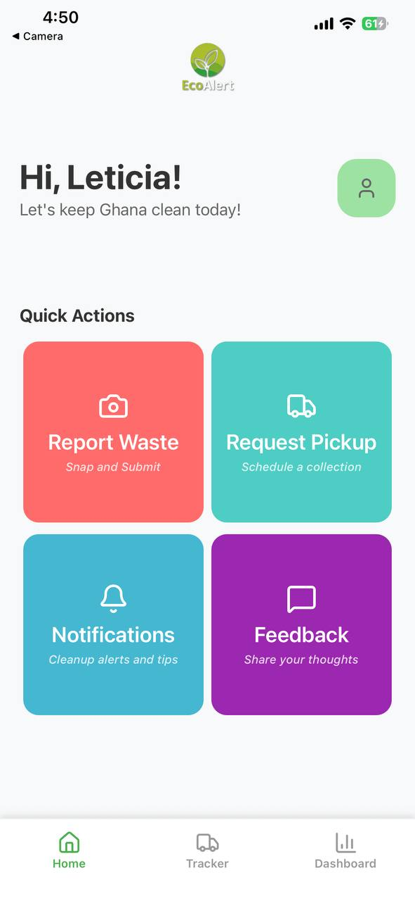
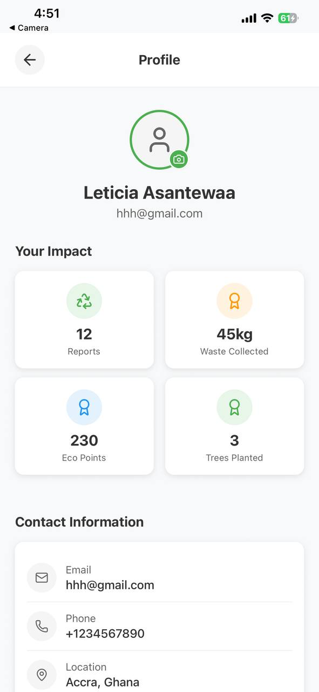
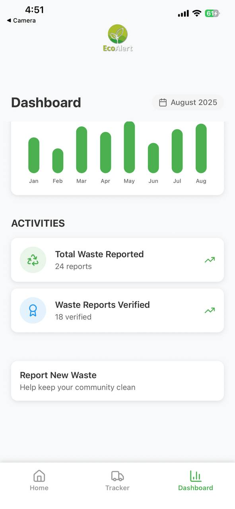
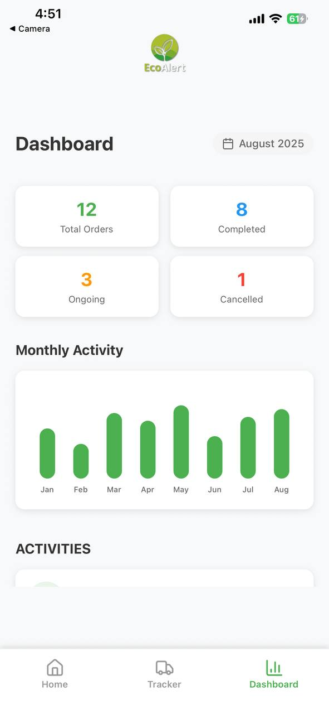
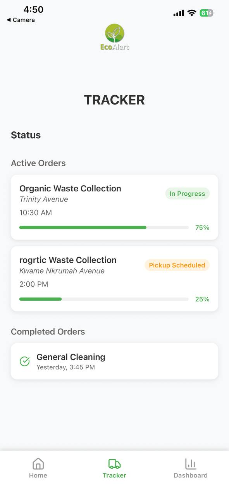

# EcoAlert 🌍📱

EcoAlert is a mobile application built with React Native (Expo) that empowers citizens to report environmental hazards such as waste dumping, pollution, and unsafe ecological practices. The goal is to create a cleaner, safer, and more sustainable environment by enabling real-time reporting and awareness.

---

## ✨ Features

- 📍 Report Hazards: Capture and submit environmental issues with photos, location, and description.  
- 🗺 Interactive Map: View reports submitted by others in your community.  
- 🔔 Notifications: Stay updated on urgent alerts or actions taken by authorities.  
- 👤 User Accounts: Sign up and log in to track your reports.  
- 📂 Report History: Access your past reports anytime.  
- 🌐 Community Impact: Promote collective responsibility for the environment.  

---

## 🛠 Tech Stack

- React Native (Expo) – cross-platform app development.  
- React Navigation – smooth screen transitions and navigation.   
- Expo Location & Camera APIs – capture media and geolocation data.  

---

## 🚀 Getting Started

### Prerequisites
- Node.js and npm (or yarn) installed  
- Expo CLI installed globally:  
  npm install -g expo-cli

### Installation
1. Clone the repository:  
   git clone https://github.com/FaisalMohammedElorm/EcoAlert.git
   cd EcoAlert

2. Install dependencies:  
   npm install  
   or  
   yarn install  

3. Run the app:  
   expo start  

4. Scan the QR code with the Expo Go app on your phone to preview.  

---

## 📸 Screenshots 

    

---

## 🧑‍🤝‍🧑 Contributing

Contributions are welcome!  
- Fork the project  
- Create your feature branch (git checkout -b feature/AmazingFeature)  
- Commit your changes (git commit -m 'Add some AmazingFeature')  
- Push to the branch (git push origin feature/AmazingFeature)  
- Open a Pull Request  

---

## 📜 License

This project is licensed under the MIT License – see the LICENSE file for details.  

---

## 🌱 Acknowledgements

- Built with ❤️ and React Native.  
- Inspired by the need for cleaner and safer communities.  
- Thanks to the Expo and React Native open-source community.  
